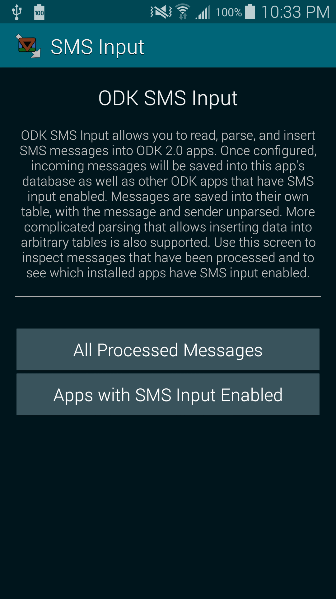
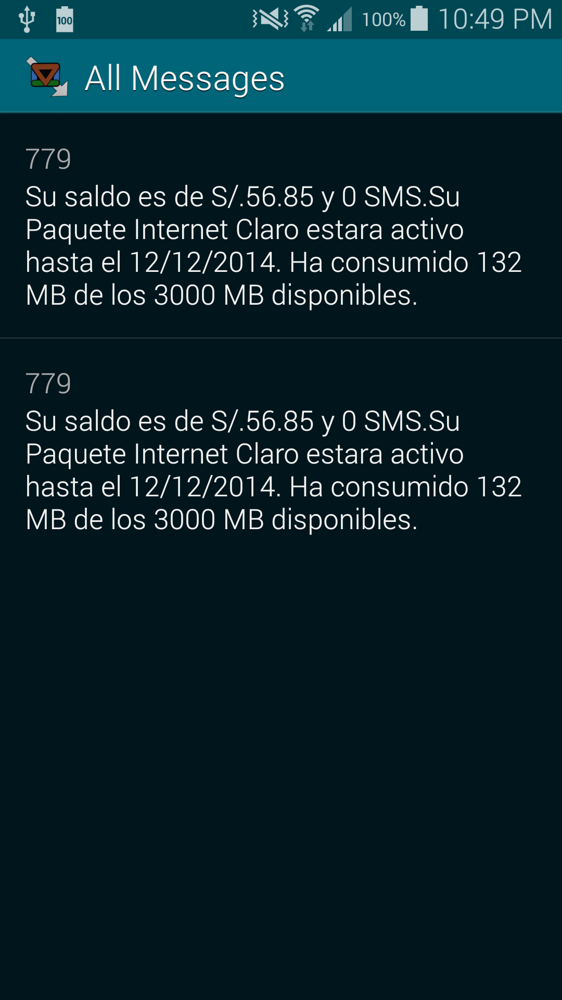
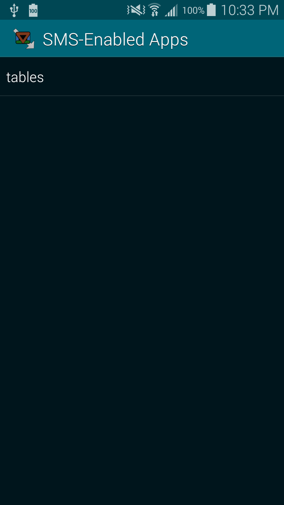

# ODK SMS Input

Allows SMS input into an [Open Data Kit (ODK)](http://opendatakit.org/) 2.0
database.

## Overview

ODK SMS Input lets you use SMS messages to input data into an ODK 2.0 database.
This allows you to use SMS to communicate with the ODK 2.0 tools and the cloud.
Once ODK SMS Input is configured on a device, messages received can be
processed and appear alongside other data in the database.

When used with the [ODK SMS Bridge](https://github.com/srsudar/odk-sms-bridge),
you can use Survey on a phone without internet connectivity, communicate that
data to a phone running ODK SMS Input, and it will all appear in the database.

While not currently on the Play Store, you can download the latest snapshot
build [here](http://samsudar.com/projects/apks/odk-sms-input-1-0-0.apk).

### Interface

For the most part, the app should work behind the scenes. A UI is included to
aid in debugging.

When installed, it stores all incoming messages into its own database. By
default it also saves all messages into the ODK Tables database, as well as any
customized processing.

<p align="center">
  
</p>

The messages saved by the app are displayed in a list. The database should be
purged from time to time if you don't need the messages.

<p align="center">
  
</p>

It also displays the ids of the installed apps it detects have SMS input
enabled.

<p align="center">
  
</p>
    

## Usage

For now, you will have to write a `processor` and a `parser` in Java, build the
app locally, and install it. Eventually we hope to make this possible via
JavaScript, which will not require building from source, but for now there is a
little heavier lift.

### Parser

The `parser` is what takes the message and determines how to extract data from
it. Callers must implement the `IMessageParser` interface.

The method `isForThisParser()` determines whether or not this `parser` should
be able to parse the value. `extractValues` takes the message and extracts from
it the values that should be inserted into the database.

> A `parser` defines how a message is converted to a format for the database.

### Table Definition

A minimal set of information must be known about a table in order to insert
data into it. This is known as the table definition. Callers must implement the
`ITableDefinition` interface.

> A table definition includes the table id and the set of columns in the table
in the database.

### Processor

The `processor` takes the received messages and does things with them. This
might include applying a number of `parser`s until it finds one, or several, 
that work. Callers must implement the `ISmsProcessor` interface.

You might have several `processor`s for a single app. For example, you might
have a `processor` that saves all messages into the database without any
parsing, so that you can also have a record of poorly formatted messages. A
second might try and parse it and insert it into a regular data table.

> A `processor` defines a unit of work on a group of messages.

### Inserter

The inserter is what performs the actual writes into the database. Callers
must extend the `AbsTableInserter` class.

The `insertValuesIntoDatabase` method takes a `ContentValues` object, as
returned by `IMessageParser#extractValues()` and writes the values into the
database.

> The inserter writes data into a particular table in the database.

## Example Code

The below code will demonstrate how an SMS can be processed and inserted into a
table with the id `plot`. We want to be able to insert data via into two
columns: `plot_name` and `planting`. There are other columns in plot, like
`pests` and `comments`, but we won't be inserting into those columns via SMS,
so we can ignore them.

The contents of the plot table before any new insertions are shown below:

| plot\_name|  planting      |    pests  |  comments  |
|-----------|----------------|-----------|------------|
|Recoleta  | Pampas-Grass   | Mosquitoes| Lush.       |

We want to allow input into this table via SMS. We will expect these messages
to have the format: `plot plot_name planting`. With the `processor` set up,
after receiving an SMS with the body: `plot Palermo Bananas`, the contents of
the table would be:

| plot\_name|  planting      |    pests  |  comments  |
|-----------|----------------|-----------|------------|
|Recoleta  | Pampas-Grass   | Mosquitoes | Lush.      |
|Palermo   | Bananas        |            |            |

### Parser

This class tries to match our format of `plot plot-name planting`. We decide if
a message is meant for the `parser` if it begins with `plot`. We then split on
spaces and create the `ContentValues` object.

```java
public class BasicPlotParser implements IMessageParser {

  @Override
  public boolean isForThisParser(OdkSms sms) {
    return sms.getMessageBody().startsWith("plot");
  }

  @Override
  public ContentValues extractValues(OdkSms sms) {
    
    String[] brokenOnSpaces = sms.getMessageBody().split(" ");
    
    ContentValues result = new ContentValues();
    
    result.put(PlotDefinition.ColumnNames.PLOT_NAME, brokenOnSpaces[1]);
    result.put(PlotDefinition.ColumnNames.PLANTING, brokenOnSpaces[2]);
    
    return result;
    
  }

}
```

### Table Definition

This defines the `plot` table. Note that in this class we only need to
explicitly define the column names that we are going to use. `pests` and
`comments` we don't need to know include, as we don't use them.

```java
public class PlotDefinition implements ITableDefinition {
  
  private static final String TABLE_ID = "plot";
  
  /**
   * This is the full definition of the table. This will include all the column
   * names--even the ones our parsers don't care about.
   */
  private ITableDefinition mFullDefinition;
  
  /**
   * Some of the column names in the table. We don't need all of them, but just
   * the ones that we'll need to refer to directly by name.
   */
  public static class ColumnNames {
    public static final String PLOT_NAME = "plot_name";
    public static final String PLANTING = "planting";
  }
  
  public PlotDefinition(
      ODKDatabaseUtils dbUtil,
      SQLiteDatabase appDatabase) {
    TableDefinitionFactory factory = new TableDefinitionFactory();
    
    this.mFullDefinition = factory.createTableDefinition(
        dbUtil,
        appDatabase,
        TABLE_ID);
    
  }

  @Override
  public String getTableId() {
    return this.mFullDefinition.getTableId();
  }

  @Override
  public List<Column> getColumns() {
    return this.mFullDefinition.getColumns();
  }

}
```

### Processor

This processor tries to process messages that might fit into the `plot` table.
It takes each message, uses a `parser` to see if it applies, and if so inserts
the extracted values into the table.

```java
public class PlotProcessor implements ISmsProcessor {
  
  PlotInserter mAccessor;
  
  public PlotProcessor(Context context, String appId) {
    ODKDatabaseUtils dbUtil = ODKDatabaseUtils.get();
    
    SQLiteDatabase database = DatabaseFactory.get().getDatabase(
        context,
        appId);
    
    PlotDefinition plotDefinition = new PlotDefinition(dbUtil, database); 
    
    this.mAccessor = new PlotInserter(dbUtil, database, appId, plotDefinition);
    
  }

  @Override
  public void processSmsMessages(List<OdkSms> messages) {
    
    BasicPlotParser parser = new BasicPlotParser();
    
    for (OdkSms message : messages) {
      
      if (parser.isForThisParser(message)) {
        
        ContentValues values = parser.extractValues(message);
        this.mAccessor.insertValuesIntoDatabase(values);
        
      }
      
    }
    
  }
  
}
```

### Inserter

This is a basic subclass that just gives the necessary context and information
about the table to the implementation in `AbsTableInserter`.

```java
public class PlotInserter extends AbsTableInserter {

  public PlotInserter(
      ODKDatabaseUtils dbUtil,
      SQLiteDatabase appDatabase,
      String appId,
      ITableDefinition tableDefinition) {
    super(dbUtil, appDatabase, appId, tableDefinition);

  }

}
```

### Plugging it In

Once we have these classes, we have to make the SMS Input machinery aware of
them. This is done by the `OdkAppReader`, which is responsible for finding all
the `processor`s that apply to a given app. Eventually it will be computed
dynamically, but for now we have to hard-code them.

Create and insert your `processor` into the list returned for your app. Here is
an example implementation inside `OdkAppReader`:

```java
public List<ISmsProcessor> getProcessorsForAppId(
    Context context,
    String appId) {

  List<ISmsProcessor> result = new ArrayList<ISmsProcessor>();

  if (appId.equals("plot_app")) {
    ISmsProcessor plotProcessor = new PlotProcessor(this.mContext, appId);
    result.add(plotProcessor);
  }

  return result;

}
```


## Building

Because the current ODK tools are maintained as
[hg](http://mercurial.selenic.com/) projects and rely on Eclipse builds rather
than the new Gradle/IntelliJ hotness, this project for now also follows an
Eclipse structure and build.

Clone the [androidcommon](https://code.google.com/p/opendatakit/source/checkout?repo=androidcommon)
repository from the ODK source page. This is an Android Library Project that
handles interactions with the ODK 2.0 database and tool suite. Update to the
`development` branch by running `hg update development`. This is the active
branch in the ODK development process. Import the `androidcommon` project. (You
don't need the `androidcommon.test` project, but you can import it as well if
you'd like.)

Then clone this repository and import the `odk-sms-input` and
`odk-sms-input-test` projects into your workspace. You should now have all
three projects visible in your workspace. It is difficult to analyze and
predict eclipse build errors, but you should be able to get all the projects to
build, perhaps after some fiddling. All the tests in the `odk-sms-input-test`
project should pass.


## Not Currently Supported by Core ODK Team

This app is currently not supported by the core [Open Data Kit (ODK)](
http://opendatakit.org/) team.

However, this **is** a supported project. Feel free to open issues and use it,
but for now you can't necessarily count on support from the entire ODK core
team.
